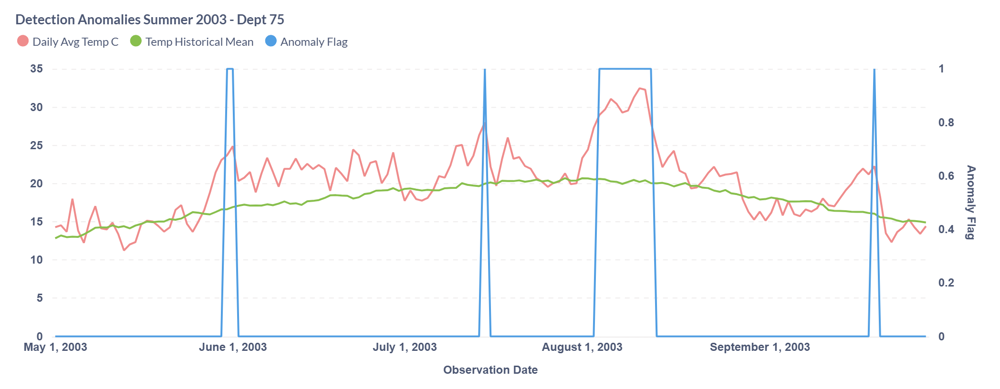
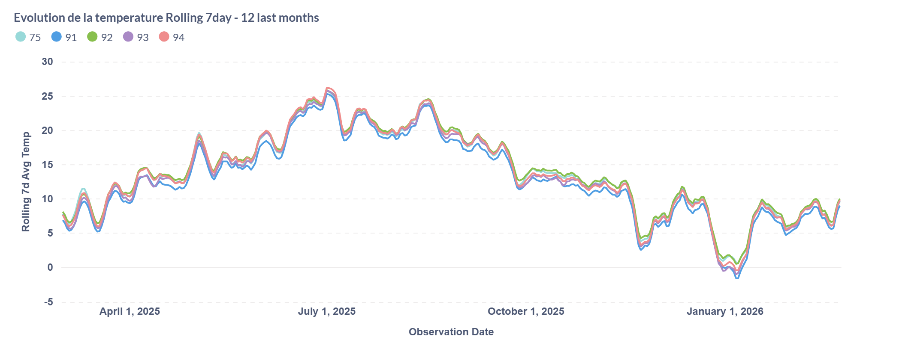

# 🌦️ Météo-France Data Pipeline & Analytics Project

## ▶️ How to Run

### 1. Environment setup
Install and Run ingestion pipeline

Make sure you have:

* Python 3.10+
* PostgreSQL running
* Environment variables set:

```bash
DB_HOST=localhost
DB_PORT=5432
DB_NAME=meteo
DB_USER=postgres
DB_PASSWORD=your_password
```

Create a virtual environment

```
python -m venv .venv
source .venv/bin/activate
```
Download the required packages
```
pip install -r requirements.txt
```
python -m src.main

---

### 2. Run Ingestion Pipeline

The ingestion pipeline is modular and can be executed step by step.

#### Step 1 — Fetch metadata

```bash
python -m src.main metadata
```

* Calls Météo-France API
* Stores dataset metadata as JSON

---

#### Step 2 — Download data files

```bash
python -m src.main download
```

* Downloads `.csv.gz` files from metadata
* Stores them locally

---

#### Step 3 — Transform into a single csv

```bash
python -m src.main transform
```
* Parses raw files
* Cleans and normalizes data

#### Step 4 - Load into PostgreSQL

```bash
python -m src.main --step load
```
* Inserts into PostgreSQL using **upsert logic**

---

#### 🔁 Full Pipeline Run

```bash
python -m src.main all
```

Runs all steps in sequence:

```text
metadata → download → transform -> load
```

---

## 📊 Example Insights

* 2003 heatwave successfully detected after data cleaning
* Z-score highlights abnormal temperature events

* Rolling averages reveal seasonal trends


---

## 📁 Project Structure

```
meteo-france/
├── src/                  # Python ingestion pipeline
│   ├── metadata/
│   ├── ingestion/
│   └── utils/
│
├── data/
│   └── metadata/
│
├── dbt/
│   └── meteo_pipeline/
│       ├── models/
│       ├── tests/
│       └── dbt_project.yml
│
└── README.md
```

---

## 📌 Overview

This project is an end-to-end **data engineering & analytics pipeline** built around public Météo-France datasets.

The goal is to simulate a **production-grade analytics workflow**, covering:

* Data ingestion
* Data cleaning & normalization
* Incremental data processing
* Analytical modeling
* Data quality validation
* Visualization (Metabase)

---

## 🏗️ Architecture

```
Météo-France API
        ↓
Python Ingestion Pipeline
        ↓
PostgreSQL (Raw Warehouse Tables)
        ↓
dbt Core (Transformation Layer)
        ↓
Analytical Data Marts
        ↓
Metabase Dashboard
```

---

## ⚙️ Tech Stack

* **Python** → ingestion & data pipeline
* **PostgreSQL** → data warehouse
* **dbt Core** → transformations & modeling
* **Metabase** → data visualization
* **VS Code** → development environment

---

## 🚀 Features

### 🔹 1. Incremental Data Ingestion

* Fetches dataset metadata from Météo-France API
* Downloads relevant `.csv.gz` files
* Loads data into PostgreSQL
* Implements **upsert logic** with composite key:

```
(station_id, observation_date)
```

* Uses a **10-day sliding window** to handle late-arriving data

---

### 🔹 2. Data Cleaning & Normalization

Key challenges addressed:

* Missing values encoded as `0`
* Inconsistent availability of temperature fields

Solution:

* Detect and remove **invalid "all-zero" records**
* Compute fallback values when needed:

  * `avg_temp = (min_temp + max_temp) / 2` when missing
* Ensure data consistency across all temperature metrics

---

### 🔹 3. dbt Transformation Layer

The transformation layer is fully implemented in **dbt Core**.

#### Model Structure:

```
models/
├── staging/
├── intermediate/
└── marts/
```

#### Layers:

* **Staging** → raw data selection (source-aligned)
* **Intermediate** → cleaned and standardized data
* **Marts** → business-level aggregations

---

### 🔹 4. Incremental dbt Models

All major marts are implemented as **incremental models**:

* `mart_department_daily`
* `mart_department_temperature_analytics`
* `mart_department_temperature_anomalies`

Incremental logic:

* Recomputes last **10 days**
* Aligns with ingestion sliding window
* Supports:

  * Late data corrections
  * Rolling window calculations

---

### 🔹 5. Analytical Models

#### 📊 Department Daily Aggregation

* Average temperature
* Min / max temperature
* Aggregated at:

```
department × day
```

---

#### 🔥 Heatwave Detection

Heatwave defined as:

> 3 consecutive days where
> 7-day rolling average temperature ≥ 25°C

---

#### 📈 Rolling Metrics

* 7-day rolling average temperature
* Used for smoothing and trend detection

---

#### ⚠️ Anomaly Detection (Z-score)

Z-score calculated as:

```
(value - historical_mean) / stddev
```

Where baseline is:

```
department × day_of_year
```

This allows:

* Seasonal normalization
* Detection of unusually hot or cold days

---

### 🔹 6. Data Quality & Testing (dbt)

Implemented using dbt tests:

* Not null constraints
* Grain validation (unique keys)
* Custom tests:

  * Temperature bounds validation
  * Detection of invalid zero-value records

Ensures pipeline robustness and prevents regression.

---


## 🎯 Future Improvements

* Add orchestration (cron / Airflow)
* Expand dashboard (heatwaves, anomalies, trends)
* Introduce semantic layer (dbt metrics)
* Add CI/CD pipeline for dbt validation
